# 🔄 SMELLO - System Flow Diagrams

This document contains comprehensive Mermaid diagrams showing all major flows in the SMELLO system.

---

## Table of Contents

1. [Complete System Architecture](#1-complete-system-architecture)
2. [User Authentication Flow](#2-user-authentication-flow)
3. [New User Onboarding Flow](#3-new-user-onboarding-flow)
4. [Returning User Flow](#4-returning-user-flow)
5. [AI Generation Flow](#5-ai-generation-flow)
6. [Project Management Flow](#6-project-management-flow)
7. [Data Persistence Flow](#7-data-persistence-flow)
8. [API Key Management Flow](#8-api-key-management-flow)
9. [Usage Tracking Flow](#9-usage-tracking-flow)
10. [Error Handling Flow](#10-error-handling-flow)

---

## 1. Complete System Architecture

```mermaid
graph TB
    subgraph "Client Layer"
        A[Web Browser] --> B[Next.js App]
        B --> C[React Components]
        B --> D[Pages/Routes]
    end
    
    subgraph "Authentication Layer"
        E[Clerk Auth]
        F[Google OAuth]
    end
    
    subgraph "API Layer"
        G[/api/generate]
        H[/api/keys]
        I[/api/profile]
        J[/api/usage-stats]
    end
    
    subgraph "Service Layer"
        K[Gemini AI]
        L[Claude AI]
        M[Firestore DB]
    end
    
    subgraph "Storage Layer"
        N[(Firestore)]
        O[Local Storage]
    end
    
    C --> E
    E --> F
    C --> G
    C --> H
    C --> I
    C --> J
    
    G --> K
    G --> L
    H --> M
    I --> M
    J --> M
    
    M --> N
    C --> O
    
    style A fill:#e1f5ff
    style B fill:#fff3e0
    style E fill:#f3e5f5
    style M fill:#e8f5e9
    style N fill:#fce4ec
```

---

## 2. User Authentication Flow

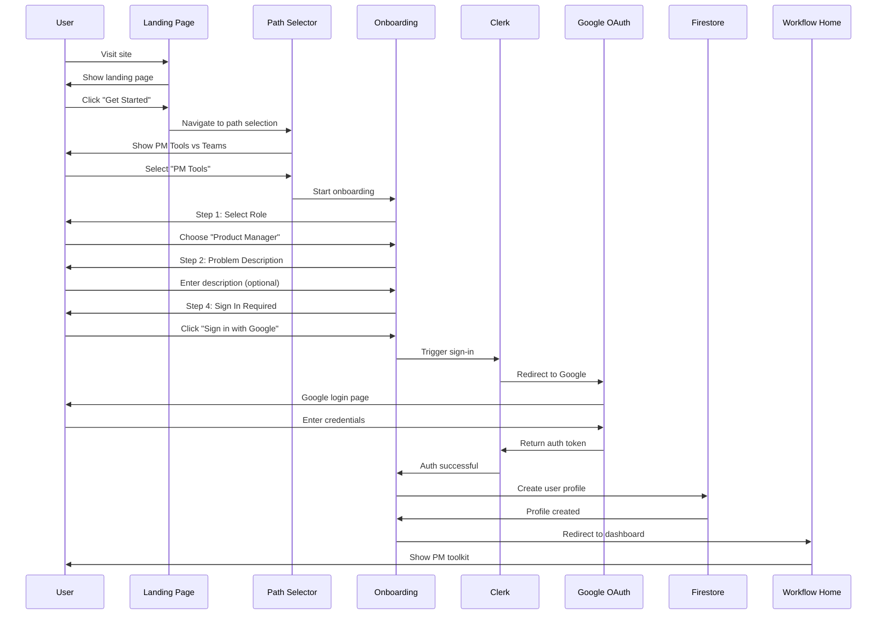

---

## 3. New User Onboarding Flow

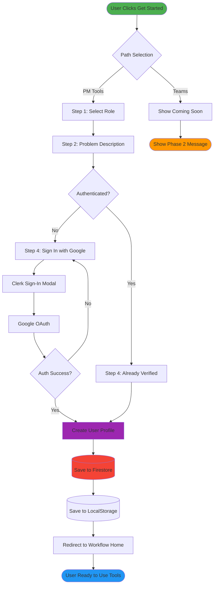

---

## 4. Returning User Flow

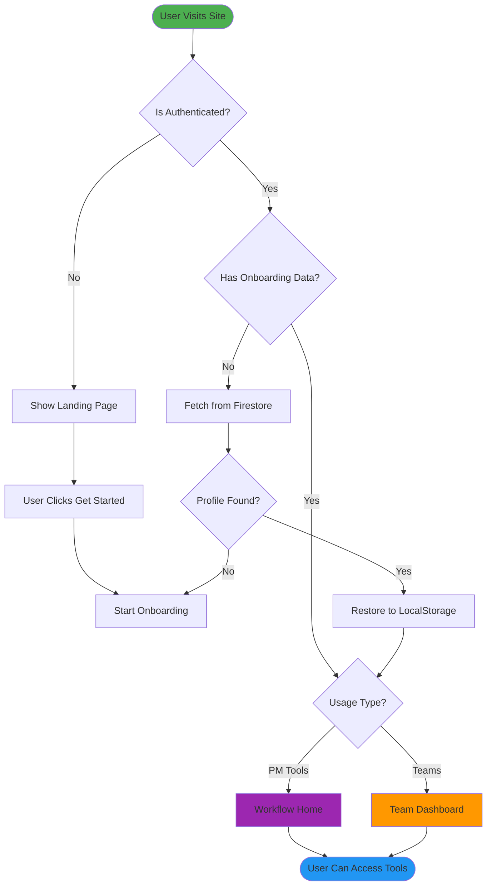

---

## 5. AI Generation Flow

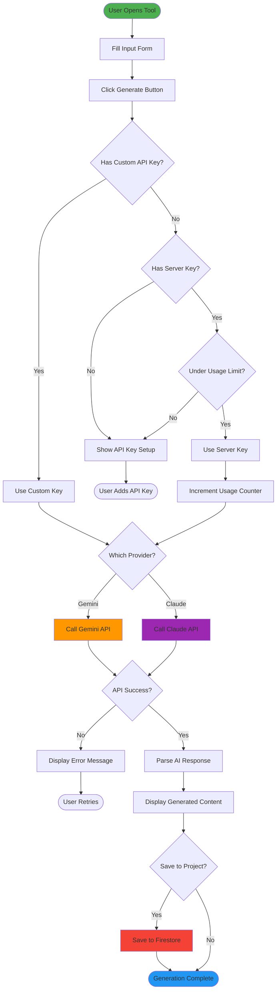

---

## 6. Project Management Flow

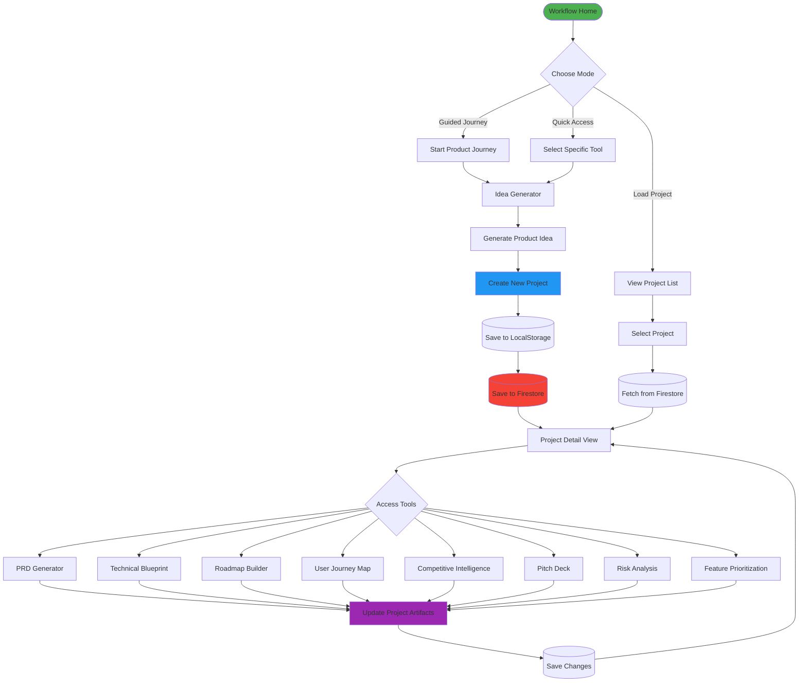

---

## 7. Data Persistence Flow

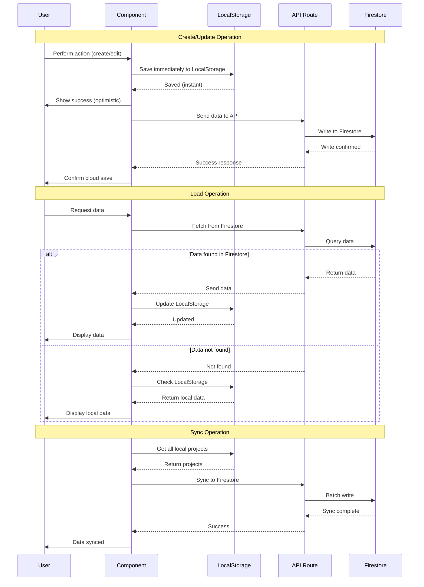

---

## 8. API Key Management Flow

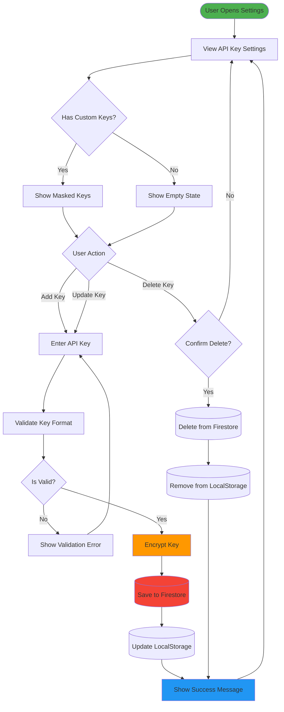

---

## 9. Usage Tracking Flow

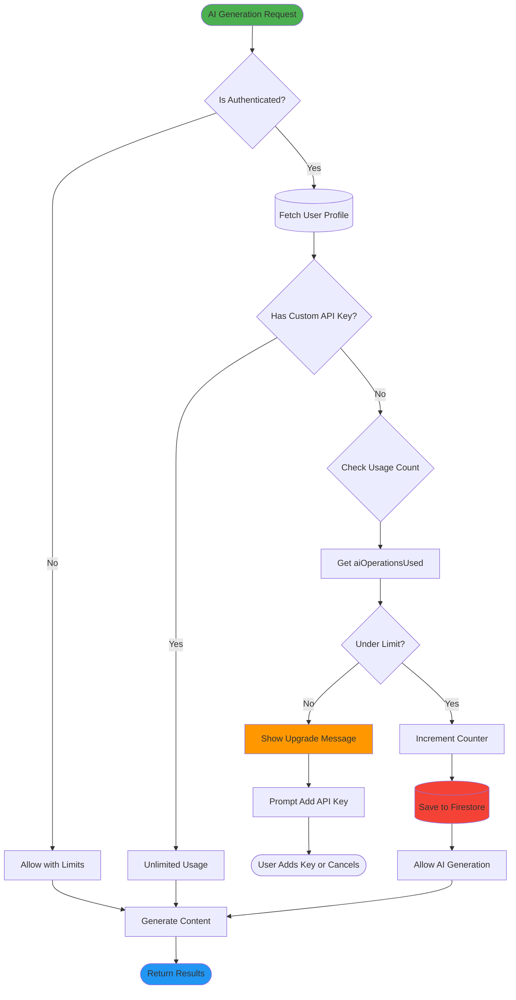

---

## 10. Error Handling Flow

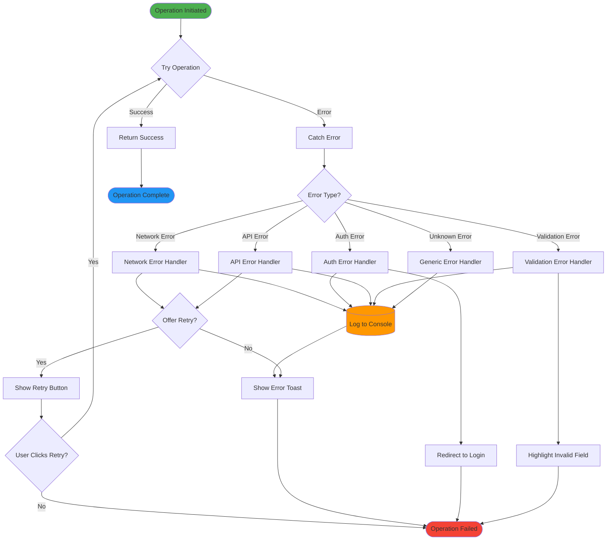

---

## 11. Complete User Journey Map

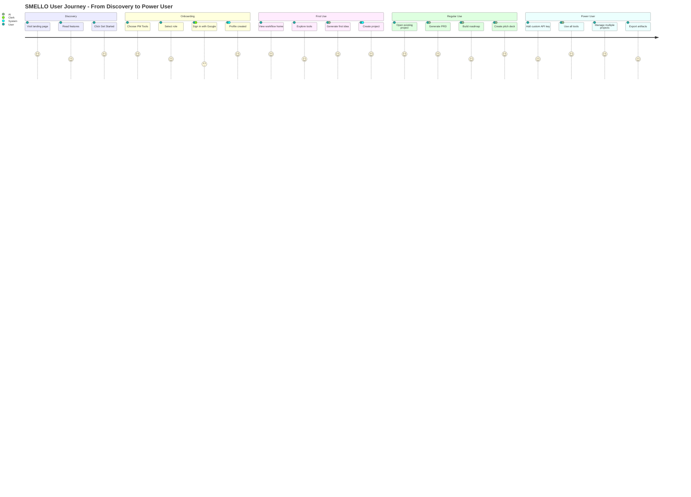

---

## 12. State Management Flow

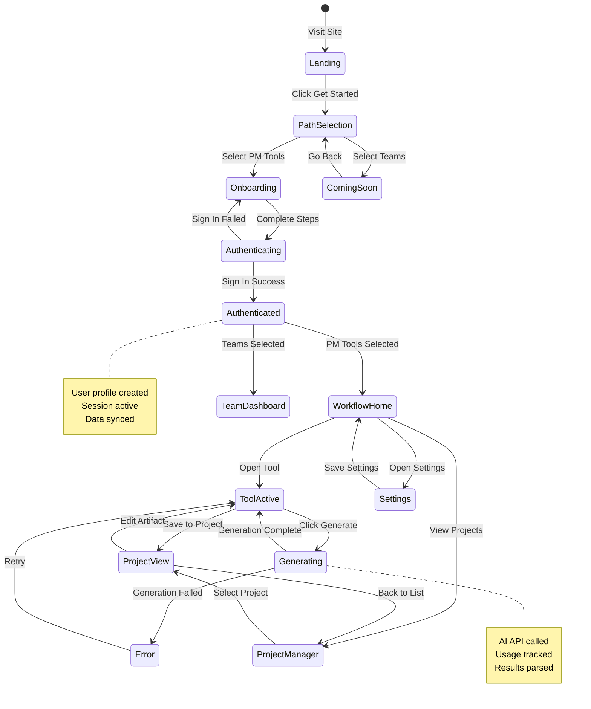

---

## How to Use These Diagrams

### Viewing in GitHub
These Mermaid diagrams will render automatically when viewing this file on GitHub.

### Viewing Locally
1. Use a Mermaid-compatible Markdown viewer
2. Use VS Code with Mermaid extension
3. Use online Mermaid Live Editor: https://mermaid.live

### Editing Diagrams
1. Copy diagram code
2. Paste into Mermaid Live Editor
3. Make changes
4. Copy back to this file

### Exporting
1. Open in Mermaid Live Editor
2. Click "Actions" → "Export"
3. Choose PNG, SVG, or PDF

---

## Diagram Legend

### Node Shapes
- `[Rectangle]` - Process/Action
- `{Diamond}` - Decision Point
- `[(Database)]` - Data Storage
- `([Rounded])` - Start/End Point
- `[[Subroutine]]` - Sub-process

### Colors (in styled diagrams)
- 🟢 Green - Start/Success
- 🔵 Blue - End/Complete
- 🟠 Orange - Warning/Alternative
- 🟣 Purple - Important Process
- 🔴 Red - Storage/Critical

---

**Document Version**: 1.0  
**Last Updated**: December 31, 2025  
**Diagrams**: 12 comprehensive flows  
**Status**: Production Documentation
