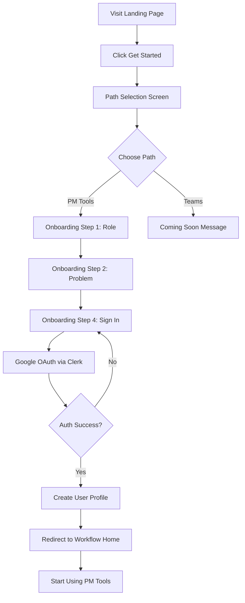
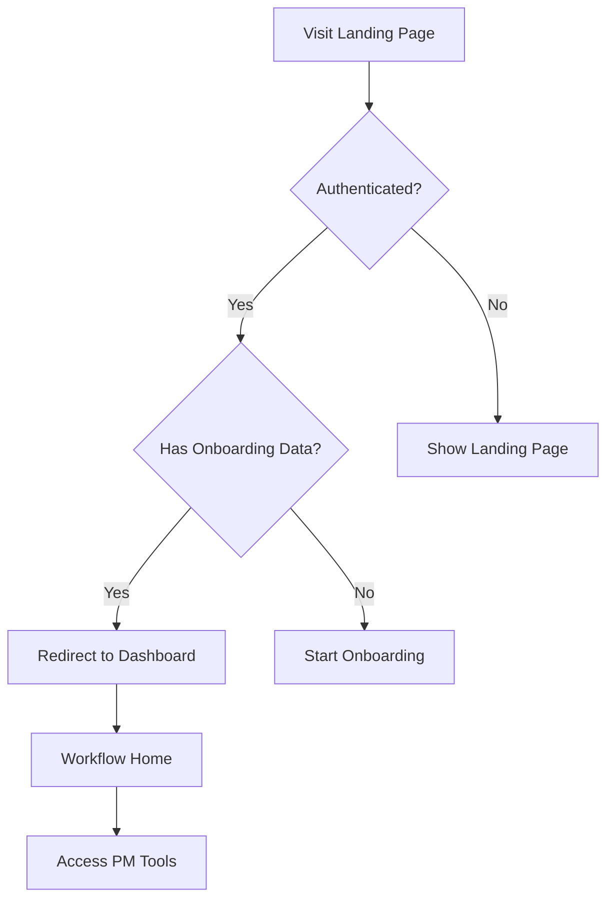
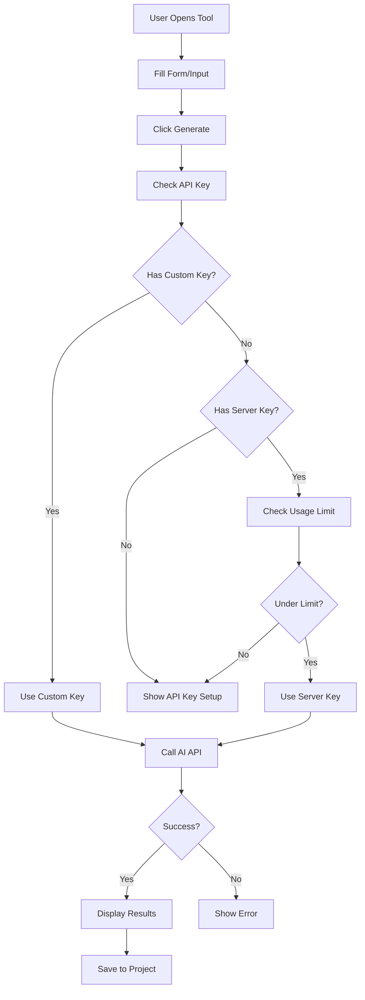
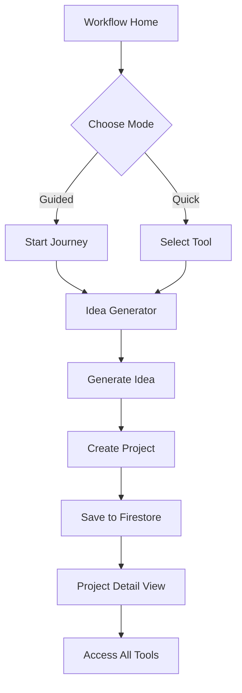

# 📊 SMELLO - System Analysis Document

## Executive Summary

**SMELLO** is an AI-powered product management toolkit designed to streamline the product development lifecycle from ideation to execution. The system combines artificial intelligence with modern web technologies to provide product managers, founders, and teams with powerful tools for creating product documentation, strategic planning, and project management.

**Version**: 1.0  
**Status**: Production Ready (PM Toolkit)  
**Last Updated**: December 31, 2025

---

## Table of Contents

1. [System Overview](#system-overview)
2. [Architecture](#architecture)
3. [Core Components](#core-components)
4. [User Flows](#user-flows)
5. [Data Model](#data-model)
6. [Security](#security)
7. [Integration Points](#integration-points)
8. [Performance](#performance)
9. [Deployment](#deployment)
10. [Future Roadmap](#future-roadmap)

---

## 1. System Overview

### 1.1 Purpose

SMELLO addresses the challenge of product documentation and strategic planning by providing:
- AI-powered document generation
- Structured product development workflows
- Centralized project management
- Strategic analysis tools

### 1.2 Target Users

**Primary Users**:
- Product Managers
- Product Owners
- Founders / CEOs
- CTO / Technical Leads

**Secondary Users**:
- Designers
- Developers
- Business Analysts
- Project Managers

### 1.3 Key Features

#### **PM Toolkit** (Current - v1.0)
1. **Idea Generator** - AI-powered product ideation
2. **PRD Generator** - Comprehensive product requirement documents
3. **Technical Blueprint** - Architecture and tech stack planning
4. **Roadmap Builder** - Visual product roadmaps
5. **User Journey Map** - Customer experience mapping
6. **Competitive Intelligence** - SWOT analysis and feature comparison
7. **Pitch Deck Generator** - Investor presentation creation
8. **Risk Analysis** - Risk identification and mitigation
9. **Feature Prioritization** - RICE framework implementation

#### **Team Collaboration** (Future - Phase 2)
- Organization management
- Team workspaces
- Real-time collaboration
- Role-based access control

---

## 2. Architecture

### 2.1 High-Level Architecture

```
┌─────────────────────────────────────────────────────────────┐
│                        CLIENT LAYER                          │
│  ┌──────────────────────────────────────────────────────┐  │
│  │           Next.js 16 (React + TypeScript)             │  │
│  │  ┌────────────┐  ┌────────────┐  ┌────────────┐     │  │
│  │  │   Pages    │  │ Components │  │   Hooks    │     │  │
│  │  └────────────┘  └────────────┘  └────────────┘     │  │
│  └──────────────────────────────────────────────────────┘  │
└─────────────────────────────────────────────────────────────┘
                            ↕
┌─────────────────────────────────────────────────────────────┐
│                     AUTHENTICATION LAYER                     │
│  ┌──────────────────────────────────────────────────────┐  │
│  │                    Clerk Auth                         │  │
│  │         (Google OAuth, Session Management)            │  │
│  └──────────────────────────────────────────────────────┘  │
└─────────────────────────────────────────────────────────────┘
                            ↕
┌─────────────────────────────────────────────────────────────┐
│                      API / SERVER LAYER                      │
│  ┌──────────────────────────────────────────────────────┐  │
│  │              Next.js API Routes                       │  │
│  │  ┌─────────┐  ┌─────────┐  ┌──────────┐  ┌────────┐│  │
│  │  │Generate │  │  Keys   │  │ Profile  │  │ Usage  ││  │
│  │  └─────────┘  └─────────┘  └──────────┘  └────────┘│  │
│  └──────────────────────────────────────────────────────┘  │
└─────────────────────────────────────────────────────────────┘
                            ↕
┌─────────────────────────────────────────────────────────────┐
│                      SERVICE LAYER                           │
│  ┌──────────────┐  ┌──────────────┐  ┌─────────────────┐  │
│  │   Gemini AI  │  │  Claude AI   │  │ Firestore DB    │  │
│  │   (Google)   │  │ (Anthropic)  │  │   (Firebase)    │  │
│  └──────────────┘  └──────────────┘  └─────────────────┘  │
└─────────────────────────────────────────────────────────────┘
```

### 2.2 Technology Stack

#### **Frontend**
- **Framework**: Next.js 16.1.1 (App Router)
- **Language**: TypeScript 5.x
- **UI Library**: React 18
- **Styling**: Tailwind CSS 3.x
- **Components**: Shadcn UI (Radix UI primitives)
- **Icons**: Lucide React
- **State Management**: React Hooks (useState, useEffect, useContext)

#### **Backend**
- **Runtime**: Node.js (Vercel Serverless)
- **API**: Next.js API Routes
- **Authentication**: Clerk
- **Database**: Firebase Firestore (NoSQL)
- **Storage**: Firebase Storage (future)

#### **AI Services**
- **Primary**: Google Gemini 1.5 Pro
- **Secondary**: Anthropic Claude 3.5 Sonnet
- **Fallback**: User-provided API keys

#### **Infrastructure**
- **Hosting**: Vercel (Edge Network)
- **CDN**: Vercel Edge Network
- **Analytics**: Vercel Analytics (optional)
- **Monitoring**: Vercel Logs

### 2.3 Design Patterns

#### **Frontend Patterns**
- **Component-Based Architecture**: Reusable React components
- **Composition over Inheritance**: Component composition
- **Custom Hooks**: Shared logic extraction
- **Context API**: Global state management
- **Server Components**: Next.js server-side rendering

#### **Backend Patterns**
- **API Gateway**: Centralized API routing
- **Service Layer**: Business logic separation
- **Repository Pattern**: Data access abstraction
- **Factory Pattern**: AI provider selection
- **Strategy Pattern**: Different AI generation strategies

---

## 3. Core Components

### 3.1 Authentication System

**Component**: Clerk Integration

**Flow**:
```
User → Landing Page → Path Selection → Onboarding → Clerk Sign-In → Workspace
```

**Features**:
- Google OAuth integration
- Session management
- User profile storage
- Role-based data

**Security**:
- Secure token handling
- HTTPS only
- CSRF protection
- XSS prevention

### 3.2 Onboarding System

**Steps**:
1. **Path Selection**: Choose PM Tools or Teams
2. **Role Selection**: Select user role
3. **Problem Description**: Optional context
4. **Authentication**: Sign in with Google
5. **Workspace Setup**: Create user profile

**Data Collected**:
- User name (from Google)
- Role (Product Manager, Founder, etc.)
- Usage type (Personal or Team)
- Problem description (optional)

### 3.3 Project Management

**Entities**:
- **Project**: Container for all artifacts
- **Product**: Core product information
- **Epics**: High-level features
- **User Stories**: Detailed requirements

**Operations**:
- Create project
- Edit project
- Delete project
- Load project
- Save project (Firestore + Local Storage)

### 3.4 AI Generation Engine

**Architecture**:
```typescript
User Input → API Route → AI Provider Selection → Generation → Response
```

**Providers**:
1. **Gemini** (Primary)
   - Fast generation
   - Good for structured output
   - Cost-effective

2. **Claude** (Secondary)
   - Better reasoning
   - Longer context
   - Higher quality

**Fallback Strategy**:
```
1. Try user's custom API key
2. Try server-side key (if available)
3. Check usage limits
4. Return error if exceeded
```

### 3.5 Storage System

**Dual Storage Strategy**:

**Firestore (Primary)**:
- User profiles
- Projects
- Organizations (future)
- Teams (future)
- Real-time sync

**Local Storage (Fallback)**:
- Offline support
- Fast access
- Migration to Firestore on auth

**Data Flow**:
```
Create → Local Storage → Firestore Sync → Cloud Backup
Load → Firestore (if auth) → Local Storage (fallback)
```

---

## 4. User Flows

### 4.1 New User Flow



### 4.2 Returning User Flow



### 4.3 AI Generation Flow



### 4.4 Project Creation Flow



---

## 5. Data Model

### 5.1 User Profile

```typescript
interface UserProfile {
  uid: string                    // Clerk user ID
  email: string                  // User email
  name: string                   // Full name
  role: string                   // Product Manager, Founder, etc.
  selectedPath: 'pm' | 'team'    // Usage type
  onboardingCompleted: boolean   // Setup status
  createdAt: Timestamp           // Account creation
  updatedAt: Timestamp           // Last update
  
  // Usage tracking
  aiOperationsUsed: number       // Free tier usage
  lastResetDate: Timestamp       // Usage reset date
  
  // API Keys (encrypted)
  customApiKeys?: {
    gemini?: string
    claude?: string
  }
  
  // Organization (future)
  organizationId?: string
  teamId?: string
}
```

### 5.2 Project

```typescript
interface Project {
  id: string                     // Unique project ID
  userId: string                 // Owner user ID
  name: string                   // Project name
  
  // Product information
  product: {
    name: string
    description: string
    sector: string
    target_audience: string
    key_features: string[]
    business_goals: string[]
  }
  
  // User stories and epics
  epics: Epic[]
  
  // Artifacts (generated content)
  artifacts?: {
    prd?: string
    blueprint?: string
    roadmap?: RoadmapData
    userJourney?: UserJourneyData
    competitive?: CompetitiveData
    pitchDeck?: PitchDeckData
    risks?: RiskData[]
  }
  
  // Metadata
  created_at: string
  updated_at: string
  lastAccessed?: string
}
```

### 5.3 Organization (Future - Phase 2)

```typescript
interface Organization {
  id: string
  name: string
  domain?: string
  createdBy: string              // Super Admin UID
  createdAt: Timestamp
  
  // Members
  members: {
    [uid: string]: {
      email: string
      name: string
      role: 'admin' | 'member' | 'viewer'
      joinedAt: Timestamp
    }
  }
  
  // Teams
  teams: string[]                // Team IDs
  
  // Settings
  settings: {
    allowPublicJoin: boolean
    requireInvitation: boolean
  }
}
```

---

## 6. Security

### 6.1 Authentication

**Provider**: Clerk  
**Method**: Google OAuth 2.0

**Security Features**:
- Secure token storage
- Automatic token refresh
- Session management
- CSRF protection

### 6.2 Authorization

**Current**:
- User-based access (own projects only)
- No role-based access (yet)

**Future (Phase 2)**:
- Organization-level access
- Team-level access
- Role-based permissions
- Invitation-only joining

### 6.3 Data Protection

**API Keys**:
- Encrypted at rest (AES-256)
- Encryption key in environment
- Never exposed to client
- Decrypted only for API calls

**User Data**:
- Stored in Firestore with security rules
- HTTPS only
- No sensitive data in localStorage
- Regular backups

**Firestore Rules**:
```javascript
// Current rules
match /users/{userId} {
  allow read, write: if request.auth.uid == userId;
}

match /projects/{projectId} {
  allow read, write: if request.auth.uid == resource.data.userId;
}
```

### 6.4 API Security

**Rate Limiting**:
- Free tier: 6 AI operations per user
- Resets monthly
- Tracked in Firestore

**Input Validation**:
- Type checking (TypeScript)
- Length limits
- Sanitization
- XSS prevention

---

## 7. Integration Points

### 7.1 Clerk Authentication

**Endpoints**:
- Sign In: `/sign-in`
- Sign Up: `/sign-up`
- User Profile: Clerk Dashboard

**Webhooks** (Future):
- User created
- User updated
- User deleted

### 7.2 Firebase Firestore

**Collections**:
- `users` - User profiles
- `projects` - User projects
- `organizations` - Organizations (future)
- `teams` - Teams (future)

**Operations**:
- Real-time listeners
- Batch writes
- Transactions
- Queries with indexes

### 7.3 AI APIs

**Google Gemini**:
- Endpoint: `https://generativelanguage.googleapis.com/v1beta/models/gemini-1.5-pro:generateContent`
- Authentication: API Key
- Rate Limits: Per API key
- Cost: Pay per token

**Anthropic Claude**:
- Endpoint: `https://api.anthropic.com/v1/messages`
- Authentication: API Key
- Rate Limits: Per API key
- Cost: Pay per token

### 7.4 Research Agent (Future - Phase 3)

**Deployment**: Google Cloud Run  
**Communication**: REST API  
**Authentication**: Service account

---

## 8. Performance

### 8.1 Optimization Strategies

**Frontend**:
- Code splitting (Next.js automatic)
- Lazy loading components
- Image optimization
- CSS purging (Tailwind)
- Tree shaking

**Backend**:
- Edge functions (Vercel)
- API route caching
- Firestore indexes
- Efficient queries

**AI Generation**:
- Streaming responses (future)
- Caching common prompts
- Optimized prompt engineering
- Provider fallback

### 8.2 Performance Metrics

**Target Metrics**:
- **LCP** (Largest Contentful Paint): < 2.5s
- **FID** (First Input Delay): < 100ms
- **CLS** (Cumulative Layout Shift): < 0.1
- **TTFB** (Time to First Byte): < 600ms

**Monitoring**:
- Vercel Analytics
- Browser DevTools
- Lighthouse scores
- Real User Monitoring (future)

---

## 9. Deployment

### 9.1 Environments

**Development**:
- Local: `localhost:3000`
- Hot reload enabled
- Debug mode
- Test API keys

**Production**:
- Platform: Vercel
- Domain: Custom domain (future)
- HTTPS enforced
- Production API keys

### 9.2 CI/CD Pipeline

**Current** (Manual):
1. Local development
2. Git commit
3. Push to GitHub
4. Vercel auto-deploy
5. Production live

**Future** (Automated):
1. Git push
2. GitHub Actions
3. Run tests
4. Build check
5. Deploy to staging
6. Manual approval
7. Deploy to production

### 9.3 Environment Variables

**Required**:
- Clerk keys
- Firebase config
- API encryption key

**Optional**:
- AI API keys (server-side)
- Usage limits
- Feature flags

---

## 10. Future Roadmap

### Phase 2: Team Collaboration (Q1 2026)

**Features**:
- Admin dashboard
- Organization management
- Invitation system
- Role-based access control
- Team workspaces
- Real-time collaboration

**Security Improvements**:
- Invitation-only joining
- Email verification
- Admin approval workflow
- Audit logs

### Phase 3: Research Agent (Q2 2026)

**Features**:
- Deploy to Google Cloud Run
- Market research generation
- Competitor analysis
- Trend identification
- Integration with PM tools

**Technical**:
- Python backend
- Google Drive integration
- Custom research frameworks
- Cost optimization

### Phase 4: Advanced Features (Q3 2026)

**Features**:
- Version control for documents
- Export to multiple formats
- Integrations (Jira, Notion, etc.)
- Custom templates
- Analytics dashboard
- Mobile app (PWA)

### Phase 5: Enterprise (Q4 2026)

**Features**:
- SSO integration
- Advanced security
- Custom branding
- Dedicated support
- SLA guarantees
- On-premise option

---

## Appendix

### A. Glossary

- **PM**: Product Manager
- **PRD**: Product Requirements Document
- **SWOT**: Strengths, Weaknesses, Opportunities, Threats
- **RICE**: Reach, Impact, Confidence, Effort
- **Epic**: Large feature or initiative
- **User Story**: Specific user requirement

### B. References

- Next.js Documentation: https://nextjs.org/docs
- Clerk Documentation: https://clerk.com/docs
- Firebase Documentation: https://firebase.google.com/docs
- Gemini API: https://ai.google.dev/docs
- Claude API: https://docs.anthropic.com/

### C. Change Log

**v1.0** (December 31, 2025)
- Initial production release
- 9 PM tools implemented
- Clerk authentication
- Firebase integration
- Mobile responsive design

---

**Document Version**: 1.0  
**Last Updated**: December 31, 2025  
**Author**: SMELLO Development Team  
**Status**: Production Ready
